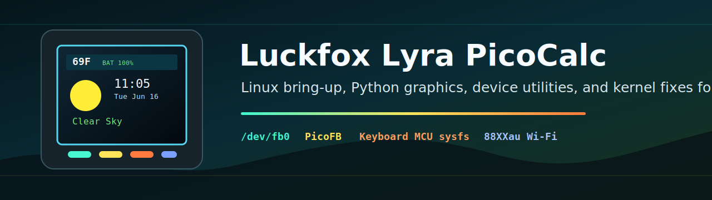
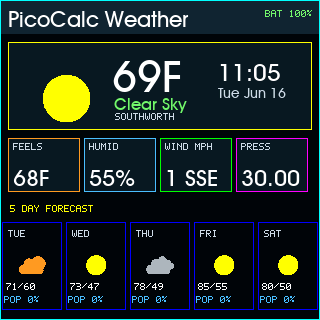

<p align="center">
  
</p>

<h1 align="center">Luckfox Lyra PicoCalc</h1>

<p align="center">
  Linux bring-up, Python framebuffer graphics, device utilities, and kernel fixes for a pocket RK3506 workstation.
</p>

<p align="center">
  
  
  
  
</p>

This tree is the publishable version of a real working build. It collects the
pieces that made the device usable:

- PicoFB, a tiny RGB565 framebuffer graphics library for `/dev/fb0`.
- A PicoCalc OpenWeather dashboard with BMP icons, battery status, Pacific time,
  and live refresh.
- A playable graphical Sudoku app converted from the CircuitPython version,
  drawing through the Linux framebuffer with reusable raw-terminal key decoding
  utilities.
- A `picocalc-app` launcher so apps work from a login shell without manually
  setting `PYTHONPATH`.
- Device helpers for screenshots, SD-card mount/eject, keyboard MCU status,
  NTP, framebuffer permissions, swap, Wi-Fi startup, and login banner updates.
- A kernel patch exposing PicoCalc keyboard MCU battery/backlight sysfs values.
- Notes for the Realtek USB Wi-Fi bring-up and the Luckfox kernel source path.



## Current Device Snapshot

Known working target:

```text
Board:       Luckfox Lyra Model B in ClockworkPi PicoCalc
Kernel:      Linux 6.1.99 armv7l
Boot path:   SD/TF rootfs with Luckfox/PicoCalc RK3506 build
Wi-Fi:       USB Realtek adapter, currently driven by 88XXau.ko
Display:     Linux framebuffer /dev/fb0, 320x320 RGB565
Python:      Python 3.11 with a non-root venv at /home/neusse/venvs/nonroot
```

## Repository Layout

```text
python/picofb/                         PicoCalc framebuffer library
python/picoterm/                       Raw terminal and ANSI helpers
python/picogames/                      Shared game logic such as Sudoku
python/circuitpython_apps/weather_icons/ BMP assets used by the weather app
examples/python/                       Weather dashboard and framebuffer demos
examples/c/                            Cross-compile smoke test
scripts/device/                        Utilities installed onto the PicoCalc
scripts/host/                          Windows/WSL helper for sync/build/run
scripts/build/                         SD/rootfs helper scripts
patches/                               Kernel and upstream build patches
tests/                                 Host-side regression tests
docs/                                  Setup notes and journey documentation
```

## Quick Start On The PicoCalc

After syncing this tree to `/home/neusse/luckfox-dev`, install the launcher:

```sh
cp scripts/device/picocalc-app /usr/local/bin/picocalc-app
chmod 755 /usr/local/bin/picocalc-app
ln -sf /usr/local/bin/picocalc-app /usr/bin/picocalc-app
ln -sf /usr/local/bin/picocalc-app /usr/bin/weather
ln -sf /usr/local/bin/picocalc-app /usr/bin/picocalc-weather
ln -sf /usr/local/bin/picocalc-app /usr/bin/sudoku
ln -sf /usr/local/bin/picocalc-app /usr/bin/picocalc-sudoku
```

Run the weather app once:

```sh
weather --once
```

Run it live:

```sh
weather
```

The live dashboard updates the clock every 30 seconds and fetches weather every
5 minutes. If a copy is already running, the launcher reports the running PID and
exits instead of starting another copy.

Run graphical Sudoku on the PicoCalc framebuffer:

```sh
sudoku
sudoku --new medium
sudoku --demo --once
```

## Host Workflow

From Windows, the host helper can sync `python/`, push an app script, and run it
over ADB:

```powershell
python .\scripts\host\luckfox-dev.py runpy .\examples\python\picocalc_weather.py --once
```

The helper assumes the active development target is:

```text
/home/neusse/luckfox-dev
```

## Secrets

No Wi-Fi password or OpenWeather API key is included. Configure secrets on the
device using environment variables or a local, untracked `secrets.py`:

```python
secrets = {
    "openweather_key": "YOUR_KEY",
    "lat": 47.0,
    "lon": -122.0,
    "units": "imperial",
}
```

## More Docs

- [Project journey](docs/journey/bring-up-journal.md)
- [Source index](docs/source-index.md)
- [Kernel source and patching](docs/kernel-source.md)
- [Wi-Fi driver notes](docs/wifi-driver.md)
- [PicoFB](docs/picofb.md)
- [PicoCalc app launcher](docs/picocalc-app-launcher.md)
- [Keyboard MCU sysfs patch](docs/picocalc-keyboard-mcu.md)
- [SD-card helper](docs/picocalc-sdcard.md)

## License

No license has been selected yet. Add one before publishing if you want others
to reuse the code under clear terms.
