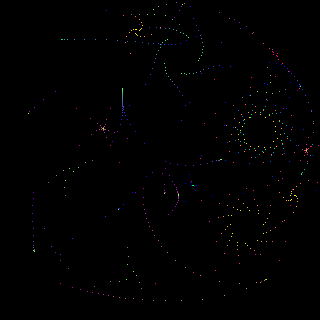

# PicoCalc Bubble Universe

`examples/python/picocalc_bubble.py` is a graphical Bubble Universe app for the
Luckfox Lyra PicoCalc. It is a Linux framebuffer conversion of the
CircuitPython `picocalc_bubble.py` app.

The app draws directly to `/dev/fb0`, reads the physical PicoCalc keyboard
through `/dev/input/event*`, and uses reusable animation logic from
`python/picogames/bubble.py`.

## Screenshot



## Source Files

```text
examples/python/picocalc_bubble.py   Framebuffer app and input loop
python/picogames/bubble.py           Bubble Universe model and renderer
python/picoterm/evdev.py             Linux input-event keyboard reader
python/picoterm/screen.py            Raw/no-echo console guard
python/picofb/                       Framebuffer drawing primitives
```

Tests:

```text
tests/test_bubble_model.py
tests/test_picocalc_bubble.py
tests/test_picoterm_evdev.py
```

## Run It

Install the app launcher first:

```sh
cp scripts/device/picocalc-app /usr/local/bin/picocalc-app
chmod 755 /usr/local/bin/picocalc-app
ln -sf /usr/local/bin/picocalc-app /usr/bin/bubble
ln -sf /usr/local/bin/picocalc-app /usr/bin/picocalc-bubble
```

Then run from the physical PicoCalc console:

```sh
bubble
```

Do not run interactive Bubble from SSH. The app intentionally requires the
physical console because it reads the real PicoCalc keyboard device and owns the
framebuffer while running.

## Controls

```text
Arrows        Pan the effect
Enter         Zoom in
Delete        Zoom out
-             Slow animation
=             Speed animation
Space         Pause/resume
Escape        Reset view
q             Quit
Backspace     Quit
```

## Host Render Command

The host development helper can render one frame for screenshots without
starting the interactive app:

```powershell
python .\scripts\host\luckfox-dev.py runpy .\examples\python\picocalc_bubble.py --once
```

## Implementation Notes

- The renderer plots directly into the PicoFB RGB565 canvas.
- The animation logic is separated into `python/picogames/bubble.py` so tests
  can exercise palette creation, coordinate generation, and controls without a
  framebuffer device.
- While running from the physical console, the app puts the console in raw mode
  so Linux does not echo keypresses over the framebuffer.

