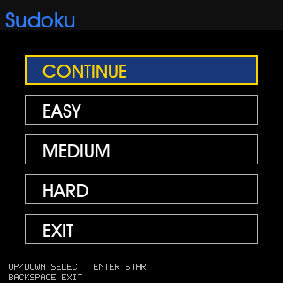

# PicoCalc Sudoku

`examples/python/picocalc_sudoku.py` is a graphical Sudoku app for the Luckfox
Lyra PicoCalc. It is a Linux framebuffer version of the earlier CircuitPython
PicoCalc Sudoku program.

The app draws to `/dev/fb0`, reads the physical PicoCalc keyboard through
`/dev/input/event*`, and uses shared game logic from `python/picogames/sudoku.py`.

## Screenshots

Start menu with a saved game:



Game board:


## Source Files

```text
examples/python/picocalc_sudoku.py   Framebuffer UI and app loop
python/picogames/sudoku.py           Sudoku model, generator, save/load logic
python/picoterm/evdev.py             Linux input-event keyboard reader
python/picoterm/screen.py            Raw/no-echo console guard
python/picofb/                       Framebuffer drawing primitives
```

Tests:

```text
tests/test_picocalc_sudoku.py
tests/test_sudoku_model.py
tests/test_picoterm_evdev.py
```

## Run It

Install the app launcher first:

```sh
cp scripts/device/picocalc-app /usr/local/bin/picocalc-app
chmod 755 /usr/local/bin/picocalc-app
ln -sf /usr/local/bin/picocalc-app /usr/bin/sudoku
ln -sf /usr/local/bin/picocalc-app /usr/bin/picocalc-sudoku
```

Then run from the physical PicoCalc console:

```sh
sudoku
```

Do not run interactive Sudoku from SSH. The app intentionally fails from SSH or
ADB shells because it needs the real PicoCalc keyboard device and owns the
framebuffer while running.

## Menu Flow

On startup, the app shows a graphical menu.

If a saved game exists:

```text
CONTINUE
EASY
MEDIUM
HARD
EXIT
```

If no saved game exists:

```text
EASY
MEDIUM
HARD
EXIT
```

Use Up/Down to move and Enter to select.

## Controls

```text
Arrows        Move the selected cell
1-9           Set a value
0 or Delete   Clear a user-entered value
s             Save
q             Save and quit
Backspace     Save and quit
```

Given puzzle cells cannot be changed.

## Save File

The default save file is:

```text
/home/neusse/.local/share/picocalc/sudoku_save.json
```

The app saves unfinished games on quit so the menu can offer `CONTINUE` later.

## Host Render Commands

The host development helper can render screenshots without starting the
interactive app:

```powershell
python .\scripts\host\luckfox-dev.py runpy .\examples\python\picocalc_sudoku.py --menu-once
python .\scripts\host\luckfox-dev.py runpy .\examples\python\picocalc_sudoku.py --demo --once
```

These commands are useful for documentation and smoke testing because they draw
one framebuffer frame and exit.

## Implementation Notes

- The app uses RGB565 colors through PicoFB.
- Text and digit sprites are cached so redraws do not re-render TrueType glyphs
  on every keypress.
- While running from the physical console, the app puts the console in raw mode
  so Linux does not echo keypress garbage over the framebuffer.
- The keyboard event device is made readable by `scripts/device/S56console_permissions`.

